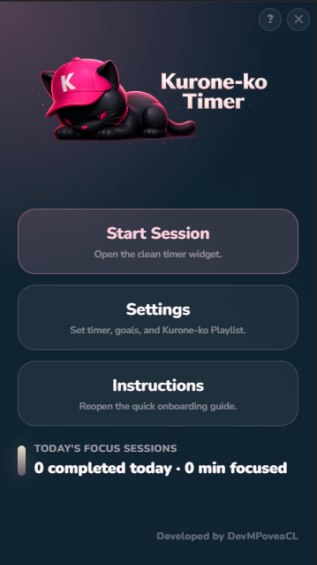
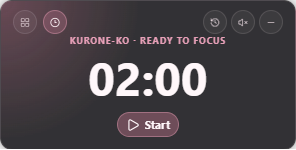

# Kurone-ko Timer

A **minimalist floating Pomodoro widget** for Windows. No accounts, no cloud, no bloat. Just a timer that floats on top of your work and stays out of the way.

The name comes from 黒猫 (kuroneko — "black cat" in Japanese), a symbol of quiet company during deep focus.

---

## Features

- **Floating timer widget** (300×150) — always-on-top, transparent, borderless. Stays visible while you work.
- **Dashboard** (360×640) — configure durations, goals, view daily focus history.
- **Pomodoro phases** — focus, short break, long break. Configurable durations and session goals.
- **Built-in music** — Kurone-ko Playlist (13 `.ogg` tracks). Music starts automatically with each focus session.
- **Daily history** — completed sessions tracked with focused minutes. Summary visible on both dashboard and timer.
- **Full keyboard control** — start, pause, reset, music, history, move windows, all without a mouse.
- **Desktop native** — built with Tauri 2. Lightweight (~5MB), no Electron, no browser dependency.

---

## Screenshots

| Dashboard | Timer widget |
|-----------|-------------|
|  |  |

---

## System requirements (users)

| Component | Requirement |
|-----------|-------------|
| **OS** | Windows 10 version 1809+ or Windows 11 |
| **WebView2** | Included with Windows 10+. Installer auto-downloads it if missing. |
| **Disk** | ~50 MB installed |
| **RAM** | ~80 MB at runtime |
| **Rust** | **Not needed** — everything is bundled in the `.exe` |

---

## Install

Download the latest `KURONE-KO_*_x64-setup.exe` from [Releases](https://github.com/DevMPoveaCL/Kurone-ko-Timer/releases).

Run the installer. A shortcut is created on your desktop and in the Start Menu.

---

## Keyboard shortcuts

### Timer widget

| Key | Action |
|-----|--------|
| `S` | Start / Pause / Resume |
| `R` | Reset timer |
| `M` | Toggle music on/off |
| `H` | Toggle history panel |

### Dashboard

| Key | Action |
|-----|--------|
| `H` | Keyboard shortcuts reference |
| `S` | Open Settings |
| `I` | Open Instructions |

### Global

| Key | Action |
|-----|--------|
| `Alt+Tab` | Bring Kurone-ko Timer into focus |
| `Escape` | Close panels / return to main view |
| `Ctrl+←↑→↓` | Move window 40px per press |
| `Tab` | Navigate between buttons and fields |
| `Enter` or `Space` | Activate focused button |
| `↑` `↓` | Scroll within focused panels |

---

## Development

### Prerequisites (developers only)

- **Node.js** 18+ and npm
- **Rust** toolchain (rustc, cargo)
- **Tauri 2** platform prerequisites ([guide](https://v2.tauri.app/start/prerequisites/))

### Setup

```bash
npm install
npm run tauri dev      # starts Vite + Tauri in dev mode
```

### Verify

```bash
npm test               # 26 files, 175 tests (Vitest)
npx tsc --noEmit       # TypeScript strict check
npm run test:e2e       # Playwright E2E (requires Tauri dev running)
```

---

## Project structure

```
src/
├── features/
│   ├── timer/          # Pomodoro core (state machine, store, UI)
│   ├── dashboard/      # Dashboard UI, modals, shortcuts
│   ├── history/        # Session tracking, daily summaries
│   ├── settings/       # Timer configuration
│   ├── music/          # Audio playback, source registry
│   └── config/         # Settings panel
├── shared/
│   ├── window/         # Window switcher, position tracking
│   ├── shortcuts/      # Keyboard shortcut hook
│   └── hydration/      # App hydration coordinator
├── App.tsx
└── App.css

src-tauri/
├── src/lib.rs          # Tauri commands
├── tauri.conf.json     # Window + bundle config
├── capabilities/       # ACL permissions
└── icons/              # App icons

tests/e2e/              # Playwright E2E smoke tests
docs/                   # Screenshots, roadmap, development journal
```

---

## Tech stack

| Layer | Technology |
|-------|-----------|
| Desktop runtime | Tauri 2 |
| Frontend | React 19 + TypeScript (strict) |
| State management | Zustand 5 |
| Styling | Pure CSS |
| Testing | Vitest 4 + Playwright |
| Backend | Rust (Tauri commands) |
| Persistence | JSON files via Tauri fs |

---

## License

[MIT](LICENSE)

*Developed by DevMPoveaCL*
